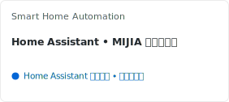
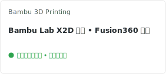

<p align="center">

</p>

<p align="center">
    <a href="https://github.com/3899">
      
    </a>
    <a href="https://github.com/3899">
      
    </a>
    <a href="https://github.com/3899">
      
    </a>
</p>

<p align="center">
<a href="https://git.io/typing-svg"></a>
</p>

### 🚀 核心开源项目

<p align="center">
  <a href="https://github.com/3899/SimAdmin">
    <picture>
      <source media="(prefers-color-scheme: dark)" srcset="https://ztxdiy.vercel.app/api/pin?username=3899&repo=SimAdmin&theme=transparent&title_color=00BFFF&text_color=e6edf3&icon_color=8b949e&hide_border=false&locale=cn&description_lines_count=3">
      <source media="(prefers-color-scheme: light)" srcset="https://ztxdiy.vercel.app/api/pin?username=3899&repo=SimAdmin&theme=transparent&title_color=0366d6&text_color=000000&icon_color=586069&hide_border=false&locale=cn&description_lines_count=3">
      
    </picture>
  </a>
  <a href="https://github.com/3899/ncmm">
    <picture>
      <source media="(prefers-color-scheme: dark)" srcset="https://ztxdiy.vercel.app/api/pin?username=3899&repo=ncmm&theme=transparent&title_color=00BFFF&text_color=e6edf3&icon_color=8b949e&hide_border=false&locale=cn&description_lines_count=3">
      <source media="(prefers-color-scheme: light)" srcset="https://ztxdiy.vercel.app/api/pin?username=3899&repo=ncmm&theme=transparent&title_color=0366d6&text_color=000000&icon_color=586069&hide_border=false&locale=cn&description_lines_count=3">
      
    </picture>
  </a>
</p>
<p align="center">
  <a href="https://github.com/3899/EcoPaste-Pro">
    <picture>
      <source media="(prefers-color-scheme: dark)" srcset="https://ztxdiy.vercel.app/api/pin?username=3899&repo=EcoPaste-Pro&theme=transparent&title_color=00BFFF&text_color=e6edf3&icon_color=8b949e&hide_border=false&locale=cn&description_lines_count=3">
      <source media="(prefers-color-scheme: light)" srcset="https://ztxdiy.vercel.app/api/pin?username=3899&repo=EcoPaste-Pro&theme=transparent&title_color=0366d6&text_color=000000&icon_color=586069&hide_border=false&locale=cn&description_lines_count=3">
      
    </picture>
  </a>
</p>

---

### 🛠️ 常用技术栈

<p align="center"><a href="https://github.com/3899/">
</a>
</p>

---

### 📊 GitHub Stats

<p align="center">
  <picture>
    <source media="(prefers-color-scheme: dark)" srcset="https://ztxdiy.vercel.app/api?username=3899&show_icons=true&theme=transparent&title_color=00BFFF&text_color=c9d1d9&icon_color=00BFFF&hide_border=false&count_private=true&locale=cn">
    <source media="(prefers-color-scheme: light)" srcset="https://ztxdiy.vercel.app/api?username=3899&show_icons=true&theme=transparent&title_color=0366d6&text_color=24292e&icon_color=0366d6&hide_border=false&count_private=true&locale=cn">
    
  </picture>
  <picture>
    <source media="(prefers-color-scheme: dark)" srcset="https://ztxdiy.vercel.app/api/top-langs?username=3899&theme=transparent&title_color=00BFFF&text_color=c9d1d9&icon_color=00BFFF&hide_border=false&locale=cn&layout=compact&langs_count=8">
    <source media="(prefers-color-scheme: light)" srcset="https://ztxdiy.vercel.app/api/top-langs?username=3899&theme=transparent&title_color=0366d6&text_color=24292e&icon_color=0366d6&hide_border=false&locale=cn&layout=compact&langs_count=8">
    
  </picture>
</p>

<p align="center">
  <picture>
    <source media="(prefers-color-scheme: dark)" srcset="https://streak-stats.demolab.com/?user=3899&theme=transparent&hide_border=false&locale=zh_CN&ring=00BFFF&fire=00BFFF&currStreakNum=00BFFF">
    <source media="(prefers-color-scheme: light)" srcset="https://streak-stats.demolab.com/?user=3899&theme=transparent&hide_border=false&locale=zh_CN&text=24292e&ring=0366d6&fire=0366d6&sideNums=24292e&sideLabels=24292e&dates=586069&currStreakNum=0366d6">
    
  </picture>
</p>

---

### 🚀 爱好

<p align="center">
  <picture>
    <source media="(prefers-color-scheme: dark)" srcset="./static/hobby-1-dark.svg">
    <source media="(prefers-color-scheme: light)" srcset="./static/hobby-1-light.svg">
    
  </picture>
  <picture>
    <source media="(prefers-color-scheme: dark)" srcset="./static/hobby-2-dark.svg">
    <source media="(prefers-color-scheme: light)" srcset="./static/hobby-2-light.svg">
    
  </picture>
</p>

### 🎵 音乐

<p align="center">
  <picture>
    <source media="(prefers-color-scheme: dark)" srcset="./static/music-dark.svg">
    <source media="(prefers-color-scheme: light)" srcset="./static/music-light.svg">
    
  </picture>
</p>

---

### 💻 个人实验室

```text
┌── Platform & OS ───────────────────────────────────────────────────────────────────────────┐
│  Proxmox VE (PVE)  •  Synology DSM  •  Docker Container  •  Debian Server  •  Arch Linux   │
└────────────────────────────────────────────────────────────────────────────────────────────┘
┌── Languages & Toolkits ────────────────────────────────────────────────────────────────────┐
│  Rust  •  Go  •  TypeScript  •  Modern C++  •  WebAssembly                                 │
└────────────────────────────────────────────────────────────────────────────────────────────┘
┌── Physical Infrastructure ─────────────────────────────────────────────────────────────────┐
│  Home Assistant  •  Tailscale Overlay Mesh  •  Node-RED Workflows  •  Frp Reverse Proxy    │
└────────────────────────────────────────────────────────────────────────────────────────────┘
```
---

<p align="center">⚖️ MIT License • Powered by @3899</p>